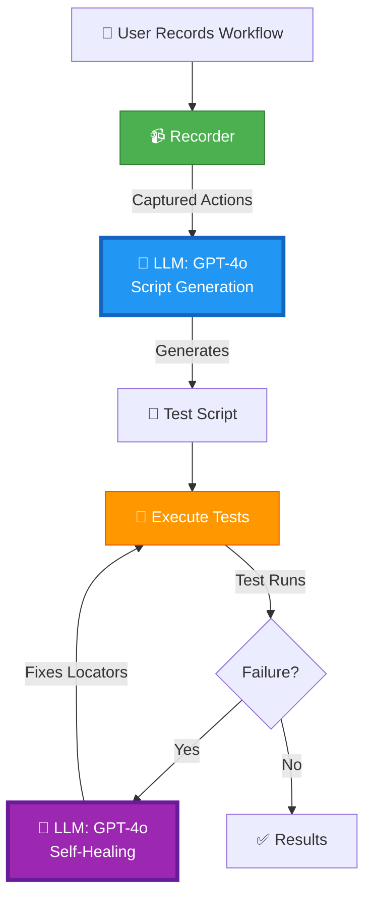
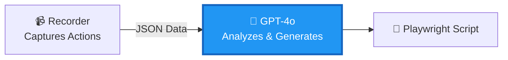
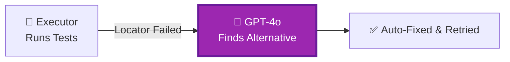

# Gen AI & LLM Integration Flow

## Where We Use Gen AI and LLMs

## Two AI Integration Points

### 1️⃣ Recorder → LLM (Script Generation)

### 2️⃣ Execute → LLM (Self-Healing)

---

## View in Mermaid Live Editor
Copy any diagram above to: **https://mermaid.live/**
