# AI-Powered Test Automation - Flow Diagram

## Mermaid Flowchart (Copy this to Mermaid Live Editor or Canvas AI)

```mermaid
flowchart TD
    Start([👤 User Starts Recording]) --> Record[📹 Intelligent Recorder<br/>Captures Actions & Context]
    
    Record --> AI[🤖 AI Script Generator<br/>Analyzes & Generates Code]
    
    AI --> Script[✅ Playwright Test Script<br/>Production Ready]
    
    Script --> Config[⚙️ Configure Execution<br/>Data Sets & Parallel Options]
    
    Config --> Execute[🚀 Parallel Execution Engine]
    
    Execute --> Browser1[🌐 Browser 1<br/>Ref ID: 10005]
    Execute --> Browser2[🌐 Browser 2<br/>Ref ID: 10003]
    Execute --> Browser3[🌐 Browser 3<br/>Ref ID: 10007]
    
    Browser1 --> Check{UI Change<br/>Detected?}
    Browser2 --> Check
    Browser3 --> Check
    
    Check -->|Yes| Heal[🔧 Self-Healing<br/>Auto-Fix Locators]
    Check -->|No| Continue[▶️ Continue]
    
    Heal --> Continue
    
    Continue --> Results[📊 Execution Complete<br/>Pass/Fail Status]
    
    Results --> Dashboard[📈 Results Dashboard<br/>Reports, Screenshots, Traces]
    
    Dashboard --> End([✨ Done])
    
    style Start fill:#4CAF50,stroke:#2E7D32,color:#fff
    style AI fill:#2196F3,stroke:#1565C0,color:#fff
    style Execute fill:#FF9800,stroke:#E65100,color:#fff
    style Heal fill:#9C27B0,stroke:#6A1B9A,color:#fff
    style Dashboard fill:#4CAF50,stroke:#2E7D32,color:#fff
    style End fill:#4CAF50,stroke:#2E7D32,color:#fff
```

## Simplified Version (Better for presentations)

```mermaid
flowchart LR
    A[📹 RECORD<br/>Manual Workflow<br/>2 min] --> B[🤖 GENERATE<br/>AI Creates Script<br/>30 sec]
    B --> C[🚀 EXECUTE<br/>Parallel Browsers<br/>3 min]
    C --> D[📊 RESULTS<br/>Reports & Traces<br/>Instant]
    
    style A fill:#4CAF50,stroke:#2E7D32,color:#fff,stroke-width:3px
    style B fill:#2196F3,stroke:#1565C0,color:#fff,stroke-width:3px
    style C fill:#FF9800,stroke:#E65100,color:#fff,stroke-width:3px
    style D fill:#9C27B0,stroke:#6A1B9A,color:#fff,stroke-width:3px
```

## Detailed Workflow with Self-Healing

```mermaid
graph TB
    subgraph Recording["🎬 RECORDING PHASE"]
        A1[User Performs Manual Task]
        A2[Recorder Captures Actions]
        A3[Extract Locators & Data]
        A1 --> A2 --> A3
    end
    
    subgraph Generation["🤖 AI GENERATION PHASE"]
        B1[Analyze Workflow]
        B2[Generate Playwright Code]
        B3[Add Error Handling]
        B4[Optimize Locators]
        B1 --> B2 --> B3 --> B4
    end
    
    subgraph Execution["⚡ EXECUTION PHASE"]
        C1[Load Test Data]
        C2[Launch Parallel Browsers]
        C3[Execute Tests]
        C1 --> C2 --> C3
    end
    
    subgraph SelfHealing["🔧 SELF-HEALING"]
        D1{Locator<br/>Failed?}
        D2[Find Alternative]
        D3[Update Script]
        D4[Retry]
        D1 -->|Yes| D2 --> D3 --> D4
        D1 -->|No| D5[Continue]
    end
    
    subgraph Results["📊 RESULTS"]
        E1[Generate Reports]
        E2[Capture Screenshots]
        E3[Save Traces]
        E4[Dashboard View]
        E1 --> E2 --> E3 --> E4
    end
    
    Recording --> Generation
    Generation --> Execution
    Execution --> SelfHealing
    SelfHealing --> Results
    
    style Recording fill:#E8F5E9,stroke:#4CAF50,stroke-width:2px
    style Generation fill:#E3F2FD,stroke:#2196F3,stroke-width:2px
    style Execution fill:#FFF3E0,stroke:#FF9800,stroke-width:2px
    style SelfHealing fill:#F3E5F5,stroke:#9C27B0,stroke-width:2px
    style Results fill:#E8F5E9,stroke:#4CAF50,stroke-width:2px
```

## Architecture Diagram

```mermaid
graph TD
    User[👤 QA Engineer] -->|Records| Frontend[🖥️ Frontend UI]
    
    Frontend -->|Sends Recording| Backend[⚙️ Backend API]
    
    Backend -->|Analyzes| AI[🤖 AI Agent<br/>GPT-4o]
    
    AI -->|Generates| Script[📝 Playwright Script]
    
    Script -->|Stored in| Repo[📁 Framework Repository]
    
    Backend -->|Triggers| Executor[🚀 Parallel Executor]
    
    Executor -->|Launches| P1[Process 1<br/>REFERENCE_ID=10005]
    Executor -->|Launches| P2[Process 2<br/>REFERENCE_ID=10003]
    Executor -->|Launches| P3[Process 3<br/>REFERENCE_ID=10007]
    
    P1 -->|Reads Data| Excel[(📊 Excel<br/>Test Data)]
    P2 -->|Reads Data| Excel
    P3 -->|Reads Data| Excel
    
    P1 -->|Tests| App[🌐 Oracle Fusion App]
    P2 -->|Tests| App
    P3 -->|Tests| App
    
    P1 -->|Results| Reports[📈 Test Reports]
    P2 -->|Results| Reports
    P3 -->|Results| Reports
    
    Reports -->|Displays| Dashboard[📊 Results Dashboard]
    
    Dashboard -->|Views| User
    
    style User fill:#4CAF50,stroke:#2E7D32,color:#fff
    style AI fill:#2196F3,stroke:#1565C0,color:#fff
    style Executor fill:#FF9800,stroke:#E65100,color:#fff
    style Dashboard fill:#9C27B0,stroke:#6A1B9A,color:#fff
```

---

## How to Use:

### Option 1: Mermaid Live Editor (Recommended)
1. Go to https://mermaid.live/
2. Copy any of the mermaid code blocks above
3. Paste into the editor
4. Download as PNG/SVG for your presentation

### Option 2: Canvas AI / Miro
1. Use the text descriptions to create visual blocks
2. Connect with arrows showing the flow
3. Use the color scheme provided in the styles

### Option 3: PowerPoint/Google Slides
1. Use SmartArt or shapes to recreate the flow
2. Follow the emoji icons and color scheme for consistency

### Color Scheme:
- 🟢 Green (#4CAF50): Start/End/Success
- 🔵 Blue (#2196F3): AI/Generation
- 🟠 Orange (#FF9800): Execution/Action
- 🟣 Purple (#9C27B0): Self-Healing/Advanced Features

