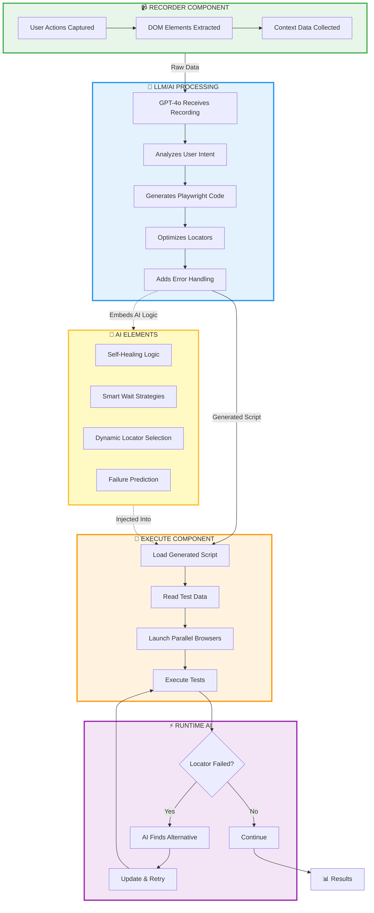
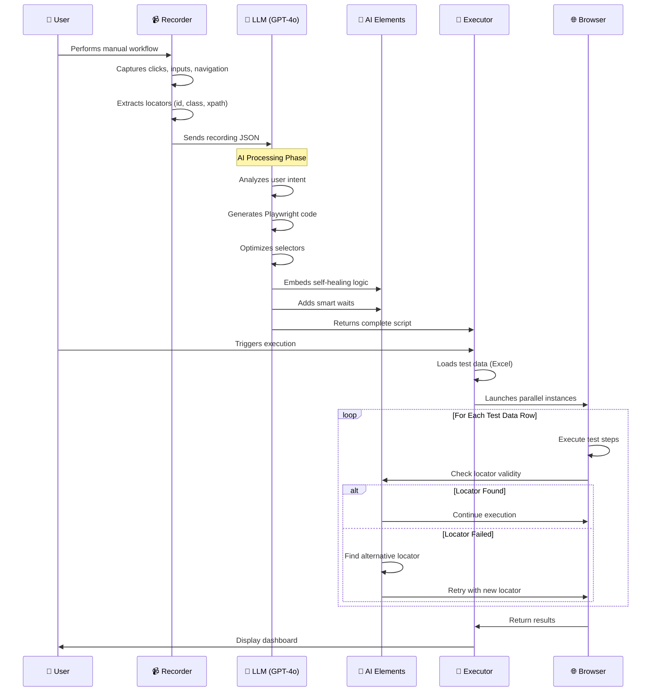
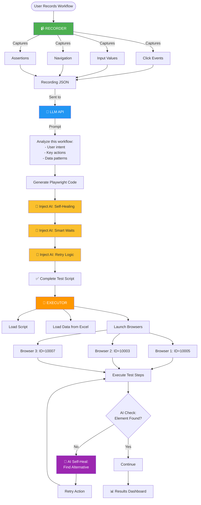

# Recorder → LLM → Execute Flow Diagram

## Complete Integration Flow

## Detailed Data Flow

## Technical Architecture

```mermaid
graph LR
    subgraph Input["INPUT LAYER"]
        I1[User Actions]
        I2[DOM Snapshot]
        I3[Screenshots]
    end
    
    subgraph RecorderEngine["RECORDER ENGINE"]
        RE1[Event Listener]
        RE2[Element Inspector]
        RE3[Context Analyzer]
    end
    
    subgraph LLMLayer["LLM LAYER"]
        LL1[Prompt Engineering]
        LL2[GPT-4o API]
        LL3[Code Generation]
        LL4[Validation]
    end
    
    subgraph AILayer["AI INTELLIGENCE LAYER"]
        AL1[Locator Optimizer]
        AL2[Self-Healing Engine]
        AL3[Smart Retry Logic]
        AL4[Failure Predictor]
    end
    
    subgraph ExecutionEngine["EXECUTION ENGINE"]
        EE1[Script Loader]
        EE2[Data Manager]
        EE3[Browser Controller]
        EE4[Parallel Orchestrator]
    end
    
    subgraph Output["OUTPUT LAYER"]
        O1[Test Results]
        O2[Screenshots]
        O3[Traces]
        O4[Reports]
    end
    
    Input --> RecorderEngine
    RecorderEngine --> LLMLayer
    LLMLayer --> AILayer
    AILayer --> ExecutionEngine
    ExecutionEngine --> Output
    
    ExecutionEngine -.->|Runtime Feedback| AILayer
    
    style Input fill:#E8F5E9
    style RecorderEngine fill:#4CAF50,color:#fff
    style LLMLayer fill:#2196F3,color:#fff
    style AILayer fill:#FBC02D
    style ExecutionEngine fill:#FF9800,color:#fff
    style Output fill:#9C27B0,color:#fff
```

## Component Interaction Details

## Key Integration Points

### 1️⃣ Recorder → LLM
- **Data Sent**: User actions, DOM elements, context
- **Format**: JSON with timestamps and metadata
- **Trigger**: User clicks "Generate Script"

### 2️⃣ LLM → AI Elements
- **Process**: LLM generates code with embedded AI logic
- **AI Features Injected**:
  - Self-healing locator strategies
  - Smart wait conditions
  - Dynamic retry mechanisms
  - Error prediction patterns

### 3️⃣ AI Elements → Executor
- **Integration**: AI logic embedded in generated script
- **Runtime**: AI activates during execution failures
- **Feedback Loop**: Executor reports back to AI for learning

### 4️⃣ Executor → Runtime AI
- **Trigger**: Locator failure or timeout
- **Action**: AI finds alternative selectors
- **Result**: Auto-heals and continues execution

---

## Visualization in Mermaid Live Editor

Copy any diagram above to: **https://mermaid.live/**

## Color Legend
- 🟢 **Green**: Recording/Input
- 🔵 **Blue**: LLM Processing
- 🟡 **Yellow**: AI Intelligence
- 🟠 **Orange**: Execution
- 🟣 **Purple**: Self-Healing/Results
