# Technical Architecture Flow

## Complete System Flow with Gen AI

```mermaid
flowchart TD
    User[👤 User Records Workflow] --> PW[🎭 Playwright Recorder<br/>Captures DOM & Actions]
    
    PW -->|Recording JSON| Agent1[🤖 Agent 1: Manual Test Case Generator<br/>LLM analyzes workflow]
    
    Agent1 -->|Test Steps| VectorDB[(📊 Vector DB<br/>Embeddings Storage)]
    
    PW -->|Recording JSON| Agent2[🤖 Agent 2: Agentic AI<br/>Automation Script Generator]
    
    Agent2 -->|Queries| VectorDB
    VectorDB -->|Context| Agent2
    
    Agent2 -->|Generates| Script[📝 Playwright Automation Script]
    
    Script --> Executor[🚀 Parallel Execution Engine<br/>Multi-Browser Orchestrator]
    
    Executor --> B1[🌐 Browser 1]
    Executor --> B2[🌐 Browser 2]
    Executor --> B3[🌐 Browser 3]
    
    B1 & B2 & B3 --> Results[📊 Reports + Screenshots + Traces]
    
    style PW fill:#4CAF50,stroke:#2E7D32,color:#fff
    style Agent1 fill:#2196F3,stroke:#1565C0,color:#fff,stroke-width:3px
    style Agent2 fill:#2196F3,stroke:#1565C0,color:#fff,stroke-width:3px
    style VectorDB fill:#FBC02D,stroke:#F57F17,stroke-width:3px
    style Executor fill:#FF9800,stroke:#E65100,color:#fff
```

## Recorder Flow - Dual Agent Architecture

## Execute Flow - Parallel Processing

```mermaid
flowchart TD
    Script[📝 Generated Script] --> Load[Load Test Data<br/>Excel/JSON]
    
    Load --> Engine[🚀 Execution Engine<br/>Parallel Orchestrator]
    
    Engine -->|Process 1| B1[Browser Instance 1<br/>Dataset Row 1]
    Engine -->|Process 2| B2[Browser Instance 2<br/>Dataset Row 2]
    Engine -->|Process 3| B3[Browser Instance 3<br/>Dataset Row 3]
    
    B1 --> R1[Results + Trace]
    B2 --> R2[Results + Trace]
    B3 --> R3[Results + Trace]
    
    R1 & R2 & R3 --> Dashboard[📊 Unified Dashboard<br/>70% Faster Execution]
    
    style Engine fill:#FF9800,color:#fff,stroke-width:3px
    style Dashboard fill:#9C27B0,color:#fff
```

---

## 📹 RECORDER
**"Capture your workflow once, automate it forever."**

### Technology Stack:
- **Playwright Recorder**: Captures DOM elements, user actions, and context
- **Agent 1 (Manual Test Case Generator)**: LLM analyzes workflow and generates human-readable test cases
- **Agent 2 (Agentic AI)**: Autonomous AI agent generates Playwright automation scripts
- **Vector DB (RAG)**: Stores embeddings for context-aware script generation

### How It Works:
1. User performs manual workflow
2. Playwright captures every action with smart locators
3. Agent 1 creates manual test documentation
4. Agent 2 queries Vector DB for similar patterns and generates optimized automation code
5. No coding required—just perform your task naturally

---

## 🚀 EXECUTE
**"Run tests in parallel, get instant results."**

### Technology Stack:
- **Parallel Execution Engine**: Multi-process orchestrator
- **Playwright Browser Automation**: Headless/headed browser control
- **Data-Driven Testing**: Excel/JSON integration
- **Trace & Screenshot Capture**: Built-in debugging artifacts

### How It Works:
1. Load generated script and test data
2. Launch multiple browser instances simultaneously
3. Each browser runs with different dataset (e.g., different user credentials)
4. Execute tests in parallel across all instances
5. Collect results, screenshots, and traces
6. Generate unified dashboard with pass/fail status

### Performance:
- **70% faster execution** through parallelization
- **Instant results** with detailed error context
- **Scalable**: Add more parallel instances as needed

---

## Gen AI Concepts Used

### 1. **Dual Agent System**
- **Agent 1**: Specialized in generating manual test cases (documentation)
- **Agent 2**: Agentic AI with autonomous decision-making for script generation

### 2. **RAG (Retrieval-Augmented Generation)**
- Vector DB stores embeddings of previous recordings
- LLM retrieves similar patterns for better script generation
- Context-aware automation based on historical data

### 3. **LLM-Powered Script Generation**
- Analyzes user intent from recorded actions
- Generates production-ready Playwright code
- Optimizes locators and adds error handling automatically

---

## View Diagrams
Copy any mermaid code to: **https://mermaid.live/**
